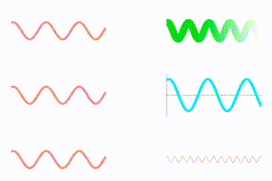

# Canvas Sine Wave
Helper class for drawing an animated sine wave into a canvas element.



## Usage
```html
<canvas id="mySine" width="300" height="150"></canvas>
```

```javascript
// Configure
var options = {color:'#0FF', strokeWidth:10, speed:0.1};

// Initialize
var sine = new CanvasSineWave(document.getElementById('mySine'), options);

// Update frequency
sine.setFrequency(30);
```

See example.html for more usage. 
